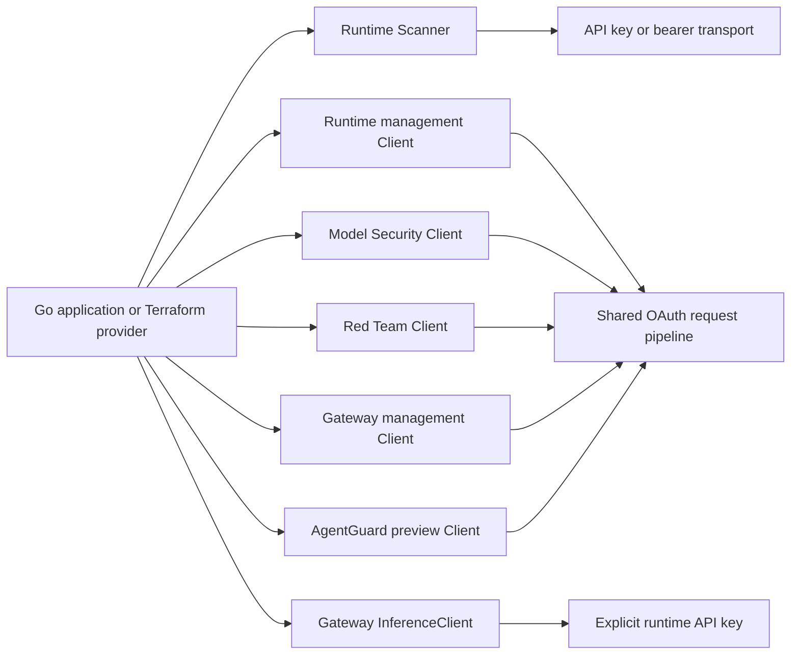

# SDK architecture

The Go SDK provides independent clients for Runtime Security, Model Security,
Red Team, AI Gateway, and skill scanning (AgentGuard public preview). Import only the packages your application
needs; the runtime module uses the Go standard library and supports Go 1.22+.

## Authentication and transport

Runtime scans accept API keys or bearer tokens. Management clients use OAuth2
client credentials with shared token caching, proactive refresh, concurrent
deduplication, and bounded authorization retries. Gateway uses SCM OAuth with
an `x-tsg-id` header on API requests. Its data and admin planes share the token
cache with its IAM plane (v0.8.0); Red Team's Network Broker has an independent API endpoint.

Constructor options override service-specific environment variables, followed
by management fallbacks where supported. Every request accepts a context, and
all API and token traffic uses the configured HTTP client. See
[configuration](../getting-started/configuration.md),
[environment variables](../reference/environment-variables.md), and
[OAuth lifecycle](../services/oauth-lifecycle.md).

## Contracts and compatibility

Established interfaces remain available alongside additive complete response
methods and generated `schema` packages. Nullable updates use `aisec.Optional[T]`
to distinguish omission, null, and a value. Explicit false, zero, and empty
collections remain distinct update intents. Gateway configuration documents
preserve dynamic JSON and unknown fields.

HTTP errors carry status and wrapped causes through `AISecSDKError`; match
sentinels with `errors.Is`. Response interpretation rejects malformed JSON and
partial results while keeping endpoint-specific text/empty delete exceptions.
See [API reference](../reference/api-reference.md) and
[error handling](../reference/error-handling.md).

## SDK and provider responsibilities

SDK methods perform explicit API operations. The caller owns reconciliation,
dependency ordering and Terraform state. SDK v0.8.0 adds
workspace provisioning: create an IAM scope, create the workspace, then bind
its slug. Partial failures expose completed steps and cleanup outcomes; binding
does not grant roles. Inference uses a separate explicit API key, SSE owns a
bounded response stream, and Realtime uses a caller-provided socket adapter.
See [TypeScript parity](typescript-parity.md) for contract provenance and limits.

Before adding a capability, consult the pinned inputs in `specs/manifest.json`
and the public HTTP contract tests. Current evidence is recorded separately in
[live verification](live-verification.md) and [feature reviews](feature-quality.md).
The [release guide](releases.md) explains source, example binaries, checksums,
and reproducible builds.

AgentGuard has six sub-clients across two explicitly configured planes. The
owner confirmed SCM OAuth for this preview; its schemas omit servers and security
definitions. All 21 operations use the shared OAuth pipeline. Signed archive
uploads and polling remain caller operations. See [AgentGuard](../services/agentguard-api.md).
