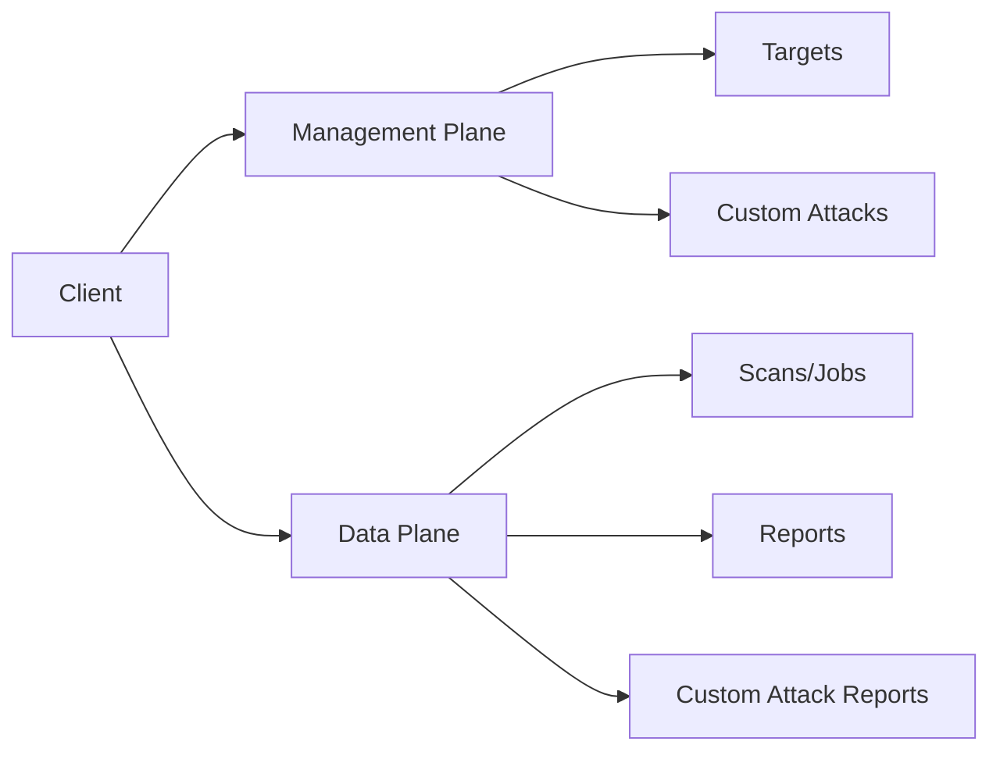

# Red Team Scanning

End-to-end workflow for automated AI red team testing: create a target, launch an attack scan, monitor progress, and retrieve the security report.

## Prerequisites

```bash
export PANW_RED_TEAM_CLIENT_ID=your-client-id       # falls back to PANW_MGMT_CLIENT_ID
export PANW_RED_TEAM_CLIENT_SECRET=your-client-secret # falls back to PANW_MGMT_CLIENT_SECRET
export PANW_RED_TEAM_TSG_ID=your-tsg-id              # falls back to PANW_MGMT_TSG_ID
```

## Architecture

The Red Team API operates across two planes:



## Workflow

### Step 1: Initialize Client

```go
client, err := redteam.NewClient(redteam.Opts{
    ClientID:     os.Getenv("PANW_RED_TEAM_CLIENT_ID"),
    ClientSecret: os.Getenv("PANW_RED_TEAM_CLIENT_SECRET"),
    TsgID:        os.Getenv("PANW_RED_TEAM_TSG_ID"),
})
if err != nil {
    log.Fatal(err)
}
```

### Step 2: Create a Target

A target represents the AI application you want to test.

```go
target, err := client.Targets.Create(ctx, redteam.TargetCreateRequest{
    Name:           "staging-chatbot",
    Description:    "Customer support chatbot - staging environment",
    TargetType:     redteam.TargetTypeApplication,
    ConnectionType: redteam.TargetConnectionTypeCustom,
    APIEndpointType: redteam.APIEndpointTypePublic,
    ResponseMode:   "REST",
    ConnectionParams: map[string]any{
        "url":    "https://staging-api.example.com/chat",
        "method": "POST",
        "headers": map[string]any{
            "Content-Type":  "application/json",
            "Authorization": "Bearer ${API_TOKEN}",
        },
        "body_template":       `{"message": "${PROMPT}"}`,
        "response_json_path":  "$.response",
    },
    TargetBackground: &redteam.TargetBackground{
        Industry: "Financial Services",
        UseCase:  "Customer Support",
    },
    AdditionalContext: &redteam.TargetAdditionalContext{
        BaseModel:    "gpt-4",
        SystemPrompt: "You are a helpful customer support assistant for a bank.",
    },
}, false) // false = skip validation probe
if err != nil {
    log.Fatal(err)
}
fmt.Printf("Target created: %s (%s)\n", target.Name, target.UUID)
```

**Response:**

```json
{
  "uuid": "a1b2c3d4-5678-90ab-cdef-1234567890ab",
  "tsg_id": "1234567890",
  "name": "staging-chatbot",
  "description": "Customer support chatbot - staging environment",
  "target_type": "APPLICATION",
  "status": "DRAFT",
  "connection_type": "CUSTOM",
  "api_endpoint_type": "PUBLIC",
  "active": false,
  "validated": false,
  "created_at": "2026-03-22T14:00:00Z",
  "updated_at": "2026-03-22T14:00:00Z"
}
```

### Step 3: Probe the Target

Validate connectivity before launching a full scan.

```go
probe, err := client.Targets.Probe(ctx, redteam.TargetProbeRequest{
    Name:           "staging-chatbot",
    ConnectionType: redteam.TargetConnectionTypeCustom,
    ResponseMode:   redteam.ResponseModeRest,
    ConnectionParams: map[string]any{
        "url":    "https://staging-api.example.com/chat",
        "method": "POST",
    },
    UUID: target.UUID,
})
if err != nil {
    log.Fatalf("Probe failed: %v", err)
}
fmt.Printf("Probe status: %s\n", probe.Status)
```

### Step 4: Launch a Red Team Scan

```go
job, err := client.Scans.Create(ctx, redteam.JobCreateRequest{
    Name:    "security-audit-q1",
    Target:  redteam.TargetJobRequest{UUID: target.UUID},
    JobType: redteam.JobTypeStatic,
})
if err != nil {
    log.Fatal(err)
}
fmt.Printf("Scan launched: %s (status: %s)\n", job.UUID, job.Status)
```

**Response:**

```json
{
  "uuid": "b2c3d4e5-6789-0abc-def1-234567890abc",
  "name": "security-audit-q1",
  "target": {
    "uuid": "a1b2c3d4-...",
    "name": "staging-chatbot"
  },
  "job_type": "STATIC",
  "status": "QUEUED",
  "total": 0,
  "completed": 0,
  "score": 0,
  "created_at": "2026-03-22T14:05:00Z"
}
```

### Step 5: Monitor Scan Progress

```go
for {
    status, err := client.Scans.Get(ctx, job.UUID)
    if err != nil {
        log.Fatal(err)
    }
    fmt.Printf("Progress: %d/%d (score: %.1f, ASR: %.1f%%)\n",
        status.Completed, status.Total, status.Score, status.ASR)

    if status.Status == "COMPLETED" || status.Status == "FAILED" {
        break
    }
    time.Sleep(30 * time.Second)
}
```

### Step 6: List Recent Scans

```go
scans, err := client.Scans.List(ctx, redteam.ScanListOpts{
    Limit:  10,
    Status: "COMPLETED",
})
if err != nil {
    log.Fatal(err)
}
for _, s := range scans.Data {
    fmt.Printf("Job=%s Target=%s Score=%.1f Status=%s\n",
        s.UUID, s.Target.Name, s.Score, s.Status)
}
```

### Step 7: Get the Report

```go
// Static report (pre-computed summary)
report, err := client.Reports.GetStaticReport(ctx, job.UUID)
if err != nil {
    log.Fatal(err)
}
b, _ := json.MarshalIndent(report, "", "  ")
fmt.Println(string(b))

// Dynamic report (on-demand, latest data)
dynReport, err := client.Reports.GetDynamicReport(ctx, job.UUID)
```

### Step 8: List Attack Results

```go
attacks, err := client.Reports.ListAttacks(ctx, job.UUID, redteam.AttackListOpts{
    Limit: 20,
})
if err != nil {
    log.Fatal(err)
}
for _, atk := range attacks.Data {
    fmt.Printf("Attack: %s — Category: %s Severity: %s Threat: %v\n",
        atk.ID, atk.Category, atk.Severity, atk.Threat)
}
```

### Step 9: Get Attack Detail

```go
detail, err := client.Reports.GetAttackDetail(ctx, job.UUID, attackID)
if err != nil {
    log.Fatal(err)
}
fmt.Printf("Prompt: %s\nResponse: %s\n", detail.Prompt, detail.Response)
```

### Step 10: Get Remediation Recommendations

```go
remediation, err := client.Reports.GetStaticRemediation(ctx, job.UUID)
if err != nil {
    log.Fatal(err)
}
b, _ := json.MarshalIndent(remediation, "", "  ")
fmt.Println(string(b))
```

### Step 11: Download Full Report

```go
// Download as CSV
data, err := client.Reports.DownloadReport(ctx, job.UUID, redteam.FileFormatCSV)
if err != nil {
    log.Fatal(err)
}
os.WriteFile("report.csv", data, 0644)

// Download as JSON
data, err = client.Reports.DownloadReport(ctx, job.UUID, redteam.FileFormatJSON)
```

## Convenience Methods

Available directly on the client for dashboards and monitoring:

```go
// Overall scan statistics
stats, err := client.GetScanStatistics(ctx, map[string]string{})

// Score trend for a target over time
trend, err := client.GetScoreTrend(ctx, target.UUID)

// Check usage quota (per scan type: Static, Dynamic, Custom)
quota, err := client.GetQuota(ctx)
fmt.Printf("Static: %d/%d consumed, Dynamic: %d/%d consumed\n",
    quota.Static.Consumed, quota.Static.Allocated,
    quota.Dynamic.Consumed, quota.Dynamic.Allocated)

// Error logs for a specific job
logs, err := client.GetErrorLogs(ctx, job.UUID, redteam.ListOpts{Limit: 50})

// Dashboard overview
overview, err := client.GetDashboardOverview(ctx)
```

## Attack Categories

Query the available attack categories before launching a scan:

```go
categories, err := client.Scans.GetCategories(ctx)
if err != nil {
    log.Fatal(err)
}
for _, cat := range categories {
    fmt.Printf("Category: %s (%d sub-categories)\n",
        cat.Name, len(cat.SubCategories))
    for _, sub := range cat.SubCategories {
        fmt.Printf("  - %s\n", sub.Name)
    }
}
```

## Target Management

### List Targets

```go
targets, err := client.Targets.List(ctx, redteam.TargetListOpts{
    Limit:      20,
    TargetType: "APPLICATION",
    Status:     "VALIDATED",
})
```

### Update Target Profile

Update the target's business context (used by the AI profiler):

```go
updated, err := client.Targets.UpdateProfile(ctx, target.UUID, redteam.TargetContextUpdate{
    TargetBackground: &redteam.TargetBackground{
        Industry:    "Healthcare",
        UseCase:     "Patient Triage",
        Competitors: []string{"competitor-a", "competitor-b"},
    },
    AdditionalContext: &redteam.TargetAdditionalContext{
        BaseModel:          "claude-sonnet-4-6",
        SystemPrompt:       "You are a medical triage assistant.",
        LanguagesSupported: []string{"en", "es"},
        BannedKeywords:     []string{"diagnosis", "prescription"},
    },
})
```

### Delete Target

```go
resp, err := client.Targets.Delete(ctx, target.UUID)
```

## Custom Attacks

### Create a Custom Prompt Set

```go
promptSet, err := client.CustomAttacks.CreatePromptSet(ctx, redteam.CustomPromptSetCreateRequest{
    // ... prompt set configuration
})

// Add prompts to the set
prompt, err := client.CustomAttacks.CreatePrompt(ctx, redteam.CustomPromptCreateRequest{
    // ... prompt configuration
})

// List active prompt sets
active, err := client.CustomAttacks.ListActivePromptSets(ctx)
```
