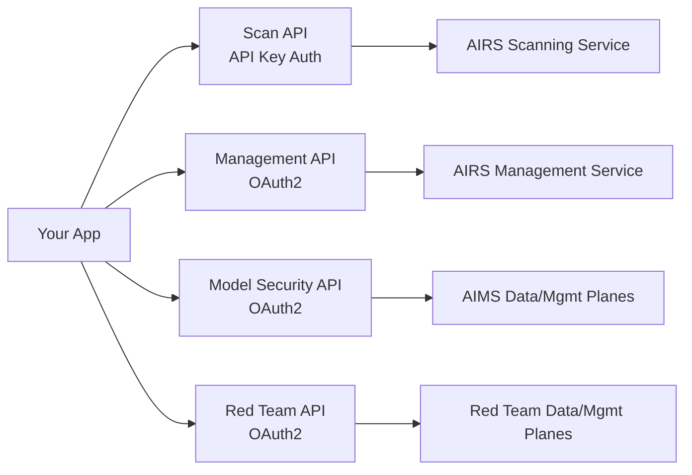

# Prisma AIRS Go SDK

Go SDK for Palo Alto Networks **Prisma AI Runtime Security (AIRS)** — a unified interface for securing AI applications across four service domains.

## Service Domains

| Domain | Description |
|--------|-------------|
| **AI Runtime Security** | Real-time content scanning for prompts, responses, and tool events |
| **Management** | Configuration CRUD for security profiles, topics, API keys, and apps |
| **Model Security** | ML model scanning, security groups, and rule management |
| **AI Red Teaming** | Automated red team scans, reports, targets, and custom attacks |

## Key Features

- **Zero external dependencies** — stdlib only (`net/http`, `crypto`, `encoding/json`)
- **Type-safe** — strongly typed models, enums, and error types
- **Context-aware** — all API methods accept `context.Context` for cancellation and timeouts
- **Thread-safe** — safe for concurrent use from multiple goroutines
- **Automatic OAuth2** — token caching, proactive refresh, 401/403 auto-retry

## Architecture

## Quick Links

- [Installation](getting-started/installation.md)
- [Quick Start](getting-started/quick-start.md)
- [Configuration](getting-started/configuration.md)
- [API Reference](reference/api-reference.md)
