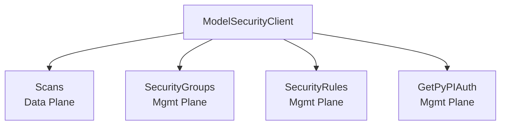

# Model Security API

The Model Security API provides ML model scanning, security group management, and security rule configuration. It uses OAuth2 client_credentials and operates across two planes: data (scans) and management (groups, rules).

## Authentication

Falls back to `PANW_MGMT_*` environment variables if service-specific variables are not set.

```go
client := modelsecurity.NewClient(modelsecurity.Opts{
    ClientID:     "your-client-id",     // or PANW_MODEL_SEC_CLIENT_ID
    ClientSecret: "your-client-secret", // or PANW_MODEL_SEC_CLIENT_SECRET
    TsgID:        "1234567890",         // or PANW_MODEL_SEC_TSG_ID
})
```

## Architecture



## Scans (Data Plane)

### CRUD Operations

```go
// Create a scan
scan, err := client.Scans.Create(ctx, modelsecurity.CreateScanRequest{
    Name:   "my-model-scan",
    Source:  modelsecurity.SourceHuggingFace,
    // ...
})

// List scans
scans, err := client.Scans.List(ctx, modelsecurity.ScanListOpts{Limit: 10})

// Get a scan
scan, err := client.Scans.Get(ctx, "scan-uuid")
```

### Evaluations

```go
// List evaluations for a scan
evals, err := client.Scans.GetEvaluations(ctx, "scan-uuid", modelsecurity.EvalListOpts{})

// Get a specific evaluation
eval, err := client.Scans.GetEvaluation(ctx, "scan-uuid", "eval-uuid")
```

### Files

```go
// List files for a scan
files, err := client.Scans.GetFiles(ctx, "scan-uuid", modelsecurity.FileListOpts{})

// Get a specific file
file, err := client.Scans.GetFile(ctx, "scan-uuid", "path/to/file")
```

### Labels

```go
// List label keys
labels, err := client.Scans.ListLabels(ctx, modelsecurity.LabelListOpts{})

// Get values for a label key
values, err := client.Scans.GetLabel(ctx, "environment", modelsecurity.LabelValueOpts{})

// Set labels on a scan
resp, err := client.Scans.SetLabels(ctx, "scan-uuid", modelsecurity.SetLabelsRequest{
    Labels: map[string]string{"environment": "production"},
})
```

## Security Groups (Management Plane)

### Group CRUD

```go
group, err := client.SecurityGroups.Create(ctx, modelsecurity.CreateGroupRequest{...})
groups, err := client.SecurityGroups.List(ctx, modelsecurity.GroupListOpts{})
group, err := client.SecurityGroups.Get(ctx, "group-id")
updated, err := client.SecurityGroups.Update(ctx, "group-id", modelsecurity.UpdateGroupRequest{...})
resp, err := client.SecurityGroups.Delete(ctx, "group-id")
```

### Rule Instances (Nested Under Groups)

```go
// List rule instances for a group
instances, err := client.SecurityGroups.ListRuleInstances(ctx, "group-id", modelsecurity.RuleInstanceListOpts{})

// CRUD on individual rule instances
instance, err := client.SecurityGroups.GetRuleInstance(ctx, "group-id", "instance-id")
instance, err := client.SecurityGroups.CreateRuleInstance(ctx, "group-id", modelsecurity.CreateRuleInstanceRequest{...})
instance, err := client.SecurityGroups.UpdateRuleInstance(ctx, "group-id", "instance-id", modelsecurity.UpdateRuleInstanceRequest{...})
resp, err := client.SecurityGroups.DeleteRuleInstance(ctx, "group-id", "instance-id")
```

## Security Rules (Management Plane, Read-Only)

```go
rules, err := client.SecurityRules.List(ctx, modelsecurity.RuleListOpts{})
rule, err := client.SecurityRules.Get(ctx, "rule-id")
```

## PyPI Authentication

```go
auth, err := client.GetPyPIAuth(ctx)
fmt.Println(auth.Username, auth.Password)
```

## Error Handling

All methods return `error` as the second return value. Errors are typed as `*aisec.AISecSDKError` when they originate from the SDK or API.
