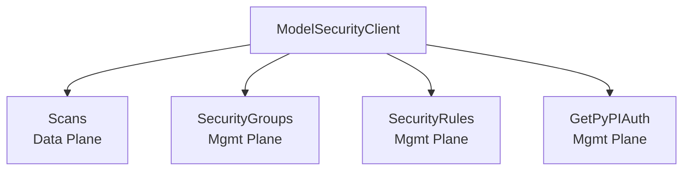

# Model Security API

The Model Security API provides ML model scanning, security group management, and security rule configuration. It uses OAuth2 client_credentials and operates across two planes: data (scans) and management (groups, rules).

## Authentication

Falls back to `PANW_MGMT_*` environment variables if service-specific variables are not set.

```go
client, err := modelsecurity.NewClient(modelsecurity.Opts{
    ClientID:     "your-client-id",     // or PANW_MODEL_SEC_CLIENT_ID
    ClientSecret: "your-client-secret", // or PANW_MODEL_SEC_CLIENT_SECRET
    TsgID:        "1234567890",         // or PANW_MODEL_SEC_TSG_ID
})
if err != nil {
    log.Fatal(err)
}
```

## Architecture



## Scans (Data Plane)

### Create and Query

```go
// Create a scan
scan, err := client.Scans.Create(ctx, modelsecurity.ScanCreateRequest{
    ModelURI:          "hf://org/model",
    SecurityGroupUUID: "group-uuid",
    ScanOrigin:        modelsecurity.ScanOriginModelSecuritySDK,
    Labels: []modelsecurity.Label{
        {Key: "env", Value: "prod"},
    },
})

// List scans
scans, err := client.Scans.List(ctx, modelsecurity.ScanListOpts{Limit: 10})

// Get a scan
scan, err := client.Scans.Get(ctx, "scan-uuid")
```

### Evaluations

```go
// List evaluations for a scan
evals, err := client.Scans.GetEvaluations(ctx, "scan-uuid", modelsecurity.EvaluationListOpts{})

// Get a specific evaluation
eval, err := client.Scans.GetEvaluation(ctx, "eval-uuid")
```

### Violations

```go
// List violations for a scan
violations, err := client.Scans.GetViolations(ctx, "scan-uuid", modelsecurity.ViolationListOpts{})

// Get a specific violation
violation, err := client.Scans.GetViolation(ctx, "violation-uuid")
```

### Files

```go
// List files for a scan
files, err := client.Scans.GetFiles(ctx, "scan-uuid", modelsecurity.FileListOpts{})
```

### Labels

```go
// Add labels to a scan
resp, err := client.Scans.AddLabels(ctx, "scan-uuid", modelsecurity.LabelsCreateRequest{
    Labels: []modelsecurity.Label{
        {Key: "env", Value: "prod"},
    },
})

// Set (replace) labels on a scan
resp, err := client.Scans.SetLabels(ctx, "scan-uuid", modelsecurity.LabelsCreateRequest{
    Labels: []modelsecurity.Label{
        {Key: "env", Value: "staging"},
    },
})

// Delete labels by key
err := client.Scans.DeleteLabels(ctx, "scan-uuid", []string{"env"})

// List label keys
keys, err := client.Scans.GetLabelKeys(ctx, modelsecurity.LabelListOpts{})

// Get values for a label key
values, err := client.Scans.GetLabelValues(ctx, "env", modelsecurity.LabelListOpts{})
```

## Security Groups (Management Plane)

### Group CRUD

```go
group, err := client.SecurityGroups.Create(ctx, modelsecurity.ModelSecurityGroupCreateRequest{
    Name:       "my-group",
    SourceType: modelsecurity.SourceTypeHuggingFace,
})
groups, err := client.SecurityGroups.List(ctx, modelsecurity.GroupListOpts{})
group, err := client.SecurityGroups.Get(ctx, "group-uuid")
updated, err := client.SecurityGroups.Update(ctx, "group-uuid", modelsecurity.ModelSecurityGroupUpdateRequest{
    Name: "updated-name",
})
err := client.SecurityGroups.Delete(ctx, "group-uuid")
```

### Rule Instances (Nested Under Groups)

```go
// List rule instances for a group
instances, err := client.SecurityGroups.ListRuleInstances(ctx, "group-uuid", modelsecurity.RuleInstanceListOpts{})

// Get a rule instance
instance, err := client.SecurityGroups.GetRuleInstance(ctx, "group-uuid", "instance-uuid")

// Update a rule instance
instance, err := client.SecurityGroups.UpdateRuleInstance(ctx, "group-uuid", "instance-uuid",
    modelsecurity.ModelSecurityRuleInstanceUpdateRequest{
        SecurityGroupUUID: "group-uuid",
        State:             modelsecurity.RuleStateBlocking,
    },
)
```

## Security Rules (Management Plane, Read-Only)

```go
rules, err := client.SecurityRules.List(ctx, modelsecurity.RuleListOpts{})
rule, err := client.SecurityRules.Get(ctx, "rule-uuid")
```

## PyPI Authentication

```go
auth, err := client.GetPyPIAuth(ctx)
fmt.Println(auth.URL, auth.ExpiresAt)
```

## Error Handling

All methods return `error` as the second return value. Errors are typed as `*aisec.AISecSDKError` when they originate from the SDK or API.
