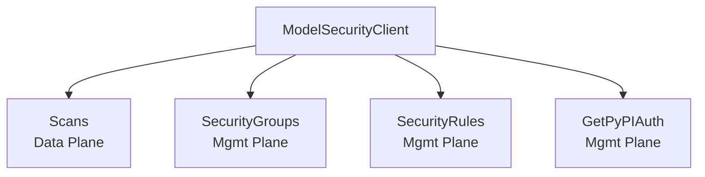

# Model Security API

The Model Security API provides ML model scanning, security group management, and security rule configuration. It uses OAuth2 client_credentials and operates across two planes: data (scans) and management (groups, rules).

## Authentication

Falls back to `PANW_MGMT_*` environment variables if service-specific variables are not set.

```go
client, err := modelsecurity.NewClient(modelsecurity.Opts{
    ClientID:     "your-client-id",     // or PANW_MODEL_SEC_CLIENT_ID
    ClientSecret: "your-client-secret", // or PANW_MODEL_SEC_CLIENT_SECRET
    TsgID:        "1234567890",         // or PANW_MODEL_SEC_TSG_ID
})
if err != nil {
    log.Fatal(err)
}
```

## Architecture


```mermaid
graph TD
    A[ModelSecurityClient] --> B[Scans<br/>Data Plane]
    A --> C[SecurityGroups<br/>Mgmt Plane]
    A --> D[SecurityRules<br/>Mgmt Plane]
    A --> E[GetPyPIAuth<br/>Mgmt Plane]
```

## Scans (Data Plane)

### Create and Query

```go
// Create a scan
scan, err := client.Scans.Create(ctx, modelsecurity.ScanCreateRequest{
    ModelURI:          "hf://org/model",
    SecurityGroupUUID: "group-uuid",
    ScanOrigin:        modelsecurity.ScanOriginModelSecuritySDK,
    Labels: []modelsecurity.Label{
        {Key: "env", Value: "prod"},
    },
})

// List scans
scans, err := client.Scans.List(ctx, modelsecurity.ScanListOpts{Limit: 10})

// Get a scan
scan, err := client.Scans.Get(ctx, "scan-uuid")
```

### Evaluations

```go
// List evaluations for a scan
evals, err := client.Scans.GetEvaluations(ctx, "scan-uuid", modelsecurity.EvaluationListOpts{})

// Get a specific evaluation
eval, err := client.Scans.GetEvaluation(ctx, "eval-uuid")
```

### Violations

```go
// List violations for a scan
violations, err := client.Scans.GetViolations(ctx, "scan-uuid", modelsecurity.ViolationListOpts{})

// Get a specific violation
violation, err := client.Scans.GetViolation(ctx, "violation-uuid")
```

### Files

```go
// List files for a scan
files, err := client.Scans.GetFiles(ctx, "scan-uuid", modelsecurity.FileListOpts{})
```

### Labels

```go
// Add labels to a scan
resp, err := client.Scans.AddLabels(ctx, "scan-uuid", modelsecurity.LabelsCreateRequest{
    Labels: []modelsecurity.Label{
        {Key: "env", Value: "prod"},
    },
})

// Set (replace) labels on a scan
resp, err := client.Scans.SetLabels(ctx, "scan-uuid", modelsecurity.LabelsCreateRequest{
    Labels: []modelsecurity.Label{
        {Key: "env", Value: "staging"},
    },
})

// Delete labels by key
err := client.Scans.DeleteLabels(ctx, "scan-uuid", []string{"env"})

// List label keys
keys, err := client.Scans.GetLabelKeys(ctx, modelsecurity.LabelListOpts{})

// Get values for a label key
values, err := client.Scans.GetLabelValues(ctx, "env", modelsecurity.LabelListOpts{})
```

## Security Groups (Management Plane)

### Group CRUD

```go
group, err := client.SecurityGroups.Create(ctx, modelsecurity.ModelSecurityGroupCreateRequest{
    Name:       "my-group",
    SourceType: modelsecurity.SourceTypeHuggingFace,
})
groups, err := client.SecurityGroups.List(ctx, modelsecurity.GroupListOpts{})
group, err := client.SecurityGroups.Get(ctx, "group-uuid")
updated, err := client.SecurityGroups.Update(ctx, "group-uuid", modelsecurity.ModelSecurityGroupUpdateRequest{
    Name: "updated-name",
})
err := client.SecurityGroups.Delete(ctx, "group-uuid")
```

### Rule Instances (Nested Under Groups)

```go
// List rule instances for a group
instances, err := client.SecurityGroups.ListRuleInstances(ctx, "group-uuid", modelsecurity.RuleInstanceListOpts{})

// Get a rule instance
instance, err := client.SecurityGroups.GetRuleInstance(ctx, "group-uuid", "instance-uuid")

// Update a rule instance
instance, err := client.SecurityGroups.UpdateRuleInstance(ctx, "group-uuid", "instance-uuid",
    modelsecurity.ModelSecurityRuleInstanceUpdateRequest{
        SecurityGroupUUID: "group-uuid",
        State:             modelsecurity.RuleStateBlocking,
    },
)
```

## Security Rules (Management Plane, Read-Only)

```go
rules, err := client.SecurityRules.List(ctx, modelsecurity.RuleListOpts{})
rule, err := client.SecurityRules.Get(ctx, "rule-uuid")
```

## PyPI Authentication

```go
auth, err := client.GetPyPIAuth(ctx)
fmt.Println(auth.URL, auth.ExpiresAt)
```

## Error Handling

All methods return `error` as the second return value. Errors are typed as `*aisec.AISecSDKError` when they originate from the SDK or API.

## Current inventory and custom rules

The current pinned contracts add `Models` and `ModelVersions` on the data plane,
and `CustomRules` on the management plane. Existing request/response types remain
source compatible. New methods use `aisec/modelsecurity/schema`, generated from
the pinned contract snapshots with `python3 scripts/schema_models.py modelsecurity`.
Run the same command with `--check` to detect stale models.

| Client | Methods |
|---|---|
| `Models` | `List`, `Get`, `ListVersions` |
| `ModelVersions` | `Get`, `ListFiles` |
| `CustomRules` | `List`, `Get`, `Create`, `Update`, `Archive`, `Unarchive`, `ListSecurityGroups`, `AssignSecurityGroups`, `RemoveAssignment`, `ListVersions` |
| `SecurityRules` | `ListVersions` |
| `SecurityGroups` | `ListRuleInstanceVersions` |

Model inventory and custom-rule array filters use repeated query keys. Scan and
group lists now also encode their array filters this way, as required by OpenAPI
form/explode semantics. `ScanListOpts.ModelVersionUUID`, `FileListOpts.Recursive`,
`RuleInstanceListOpts.IsCustom`/`Generation`, and `RuleListOpts.Generation` expose
new filters. Pointer options preserve an explicit false or zero.

Snapshot lists use `SnapshotListOpts.NextToken`, an opaque cursor. A generation
filter selects a historical snapshot, where upstream ignores other filters and
may return null timestamps, rule UUIDs, or condition trees.

### Omitted values and explicit clears

Current schema models distinguish omitted optional fields, null, and values.
For optional nullable fields, use `aisec.Value(value)` or `aisec.Null[T]()`. Their
zero value omits the field. Optional non-nullable fields use pointers. Required
nullable fields use pointers, where nil emits null.

```go
import "github.com/cdot65/prisma-airs-go/aisec/modelsecurity/schema"

updated, err := client.SecurityGroups.UpdateFields(ctx, groupUUID,
    schema.ModelSecurityGroupUpdateRequest{
        Description: aisec.Value(""), // explicitly clear the description
    })
```

`Scans.CreateDetails`, `GetDetails`, and `ListDetails`, plus
`SecurityGroups.GetRuleInstanceDetails`, `ListRuleInstanceDetails`,
`UpdateFields`, and `UpdateRuleInstanceFields`, provide the current types for
callers that need nullable fields or precise update semantics. Existing methods
retain their legacy types. Legacy string response fields still collapse null to
an empty string; choose the corresponding details method when this matters.

### Custom conditions and assignment outcomes

Custom-rule conditions have typed union constructors/accessors for label
conditions, rule-result conditions, and recursive condition groups. Enum types
accept future string values. The SDK preserves schema structure and presence;
the service validates limits and semantic constraints.

```go
condition, err := schema.NewCustomRuleCreateRequestConditionFromLabelCondition(
    schema.LabelCondition{
        Type: "label", Key: "classification", Operator: "equals",
        Value: aisec.Value("sensitive"),
    })
if err != nil { return err }
rule, err := client.CustomRules.Create(ctx, schema.CustomRuleCreateRequest{
    Name: "Sensitive models", CompatibleSources: []schema.SourceType{"LOCAL"},
    Condition: condition, ViolationMessage: "Sensitive model detected",
})
```

`AssignSecurityGroups` returns the complete HTTP 207 response. Inspect each
result's `Status`, `Error`, and `RuleInstanceUUID`: a successful HTTP request can
contain failed assignments. The SDK does not flatten those into a single error.
Archive/unarchive and assignment removal accept documented empty 204 responses.
Custom rules have no upstream delete endpoint; archive is their lifecycle action.

Live verification requires an active Model Security license. See the
[live verification record](../developer/live-verification.md) for tenant results.
