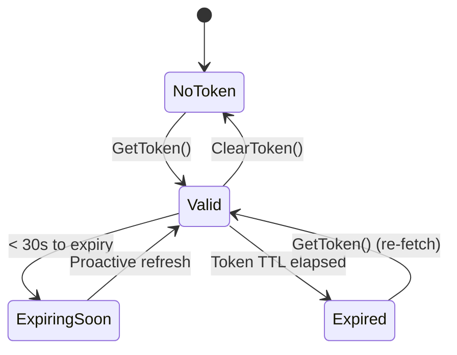

# OAuth Lifecycle

All OAuth2-based clients (Management, Model Security, Red Team) share a common token lifecycle implementation. The SDK handles token caching, proactive refresh, and automatic retry on auth failures.

## Token States



| State | Description |
|-------|-------------|
| **NoToken** | No token cached; next API call triggers fetch |
| **Valid** | Token cached and usable |
| **ExpiringSoon** | Token expiring within buffer window (default 30s) |
| **Expired** | Token past TTL; next call triggers re-fetch |

## Token Info

Inspect token state without exposing the raw token:

```go
info := client.GetTokenInfo()
fmt.Printf("Has token: %v\n", info.HasToken)
fmt.Printf("Valid: %v\n", info.IsValid)
fmt.Printf("Expired: %v\n", info.IsExpired)
fmt.Printf("Expiring soon: %v\n", info.IsExpiringSoon)
fmt.Printf("Expires in: %v\n", info.ExpiresIn)
```

## Proactive Refresh

The SDK refreshes tokens **before** they expire. The default buffer is 30 seconds — if a request happens within 30s of expiry, the SDK fetches a new token proactively.

```go
client := management.NewClient(management.Opts{
    TokenBufferMs: 60000, // refresh 60s before expiry
})
```

## Concurrent Request Deduplication

When multiple goroutines call `GetToken()` simultaneously and no token is cached, the SDK ensures only one token fetch occurs. All concurrent callers receive the same token.

## Auto-Retry on 401/403

If an API call returns 401 or 403:

1. The SDK clears the cached token
2. Fetches a new token
3. Retries the request once
4. This retry does **not** consume the retry budget

## Configuration

| Option | Default | Description |
|--------|---------|-------------|
| `TokenEndpoint` | `https://auth.apps.paloaltonetworks.com/oauth2/access_token` | OAuth2 token endpoint |
| `TokenBufferMs` | `30000` | Pre-expiry refresh buffer (ms) |
| `NumRetries` | `5` | Max retries (separate from auth retry) |
