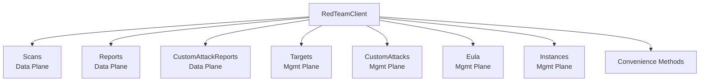

# Red Team API

The Red Team API provides automated attack testing for AI applications. It operates across two planes: data (scans, reports) and management (targets, custom attacks).

## Authentication

Falls back to `PANW_MGMT_*` environment variables if service-specific variables are not set.

```go
client, err := redteam.NewClient(redteam.Opts{
    ClientID:     "your-client-id",     // or PANW_RED_TEAM_CLIENT_ID
    ClientSecret: "your-client-secret", // or PANW_RED_TEAM_CLIENT_SECRET
    TsgID:        "1234567890",         // or PANW_RED_TEAM_TSG_ID
})
if err != nil {
    log.Fatal(err)
}
```

## Architecture



## Scans (Data Plane)

```go
// Create a scan job
job, err := client.Scans.Create(ctx, redteam.JobCreateRequest{
    Name:   "security-audit",
    Target: redteam.TargetJobRequest{UUID: "target-uuid"},
    // ...
})

// List scans
scans, err := client.Scans.List(ctx, redteam.ScanListOpts{Limit: 10})

// Get scan details
scan, err := client.Scans.Get(ctx, "job-uuid")

// Abort a running scan
resp, err := client.Scans.Abort(ctx, "job-uuid")

// Get attack categories
categories, err := client.Scans.GetCategories(ctx)
for _, cat := range categories {
    fmt.Printf("Category: %s (%d subcategories)\n", cat.Name, len(cat.SubCategories))
}
```

## Reports (Data Plane)

```go
// Get static report (pre-computed)
staticReport, err := client.Reports.GetStaticReport(ctx, "job-id")

// Get dynamic report (on-demand)
dynamicReport, err := client.Reports.GetDynamicReport(ctx, "job-id")

// List attacks in a report
attacks, err := client.Reports.ListAttacks(ctx, "job-id", redteam.AttackListOpts{})

// Get attack detail
detail, err := client.Reports.GetAttackDetail(ctx, "job-id", "attack-id")

// Get remediation and runtime policy (static and dynamic)
remediation, err := client.Reports.GetStaticRemediation(ctx, "job-id")
policy, err := client.Reports.GetStaticRuntimePolicy(ctx, "job-id")
dynRemediation, err := client.Reports.GetDynamicRemediation(ctx, "job-id")
dynPolicy, err := client.Reports.GetDynamicRuntimePolicy(ctx, "job-id")

// Get multi-turn attack detail
multiTurn, err := client.Reports.GetMultiTurnAttackDetail(ctx, "job-id", "attack-id")

// List goals and streams
goals, err := client.Reports.ListGoals(ctx, "job-id", redteam.GoalListOpts{})
streams, err := client.Reports.ListGoalStreams(ctx, "job-id", "goal-id", redteam.ListOpts{})
streamDetail, err := client.Reports.GetStreamDetail(ctx, "stream-id")

// Download report as CSV, JSON, or ALL
data, err := client.Reports.DownloadReport(ctx, "job-id", redteam.FileFormatCSV)
```

## Custom Attack Reports (Data Plane)

```go
// Get custom attack report for a job
report, err := client.CustomAttackReports.GetReport(ctx, "job-id")

// Get prompt sets and prompts
promptSets, err := client.CustomAttackReports.GetPromptSets(ctx, "job-id")
prompts, err := client.CustomAttackReports.GetPromptsBySet(ctx, "job-id", "prompt-set-id",
    redteam.PromptsBySetListOpts{})
detail, err := client.CustomAttackReports.GetPromptDetail(ctx, "job-id", "prompt-id")

// List custom attacks in a report
attacks, err := client.CustomAttackReports.ListCustomAttacks(ctx, "job-id",
    redteam.CustomAttacksReportListOpts{})

// Get attack outputs and property stats
outputs, err := client.CustomAttackReports.GetAttackOutputs(ctx, "job-id", "attack-id")
stats, err := client.CustomAttackReports.GetPropertyStats(ctx, "job-id")
```

## Targets (Management Plane)

```go
// Create a target
target, err := client.Targets.Create(ctx, redteam.TargetCreateRequest{
    Name: "my-chatbot",
    TargetBackground: &redteam.TargetBackground{
        Industry: "Finance",
        UseCase:  "Customer Support",
    },
    AdditionalContext: &redteam.TargetAdditionalContext{
        BaseModel:    "gpt-4",
        SystemPrompt: "You are a helpful assistant.",
    },
    // ... connection parameters
}, false)

// CRUD operations
targets, err := client.Targets.List(ctx, redteam.TargetListOpts{})
target, err := client.Targets.Get(ctx, "target-uuid")
updated, err := client.Targets.Update(ctx, "target-uuid", redteam.TargetUpdateRequest{
    Name: "updated-chatbot",
}, false)
resp, err := client.Targets.Delete(ctx, "target-uuid")

// Probe target (validate connection)
probe, err := client.Targets.Probe(ctx, redteam.TargetProbeRequest{Name: "test"})

// Get/update target profile
profile, err := client.Targets.GetProfile(ctx, "target-uuid")
updated, err = client.Targets.UpdateProfile(ctx, "target-uuid", redteam.TargetContextUpdate{
    TargetBackground: &redteam.TargetBackground{Industry: "Healthcare"},
})

// Validate target auth configuration
validation, err := client.Targets.ValidateAuth(ctx, redteam.TargetAuthValidationRequest{
    AuthType:   redteam.AuthConfigTypeHeaders,
    AuthConfig: redteam.HeadersAuthConfig{AuthHeader: map[string]string{"X-API-Key": "key"}},
})
```

## Custom Attacks (Management Plane)

Manages custom prompt sets and individual prompts for attack testing.

### Prompt Sets

```go
// Create a custom prompt set
promptSet, err := client.CustomAttacks.CreatePromptSet(ctx, redteam.CustomPromptSetCreateRequest{...})

// List, get, update, archive prompt sets
sets, err := client.CustomAttacks.ListPromptSets(ctx, redteam.PromptSetListOpts{})
set, err := client.CustomAttacks.GetPromptSet(ctx, "prompt-set-uuid")
updated, err := client.CustomAttacks.UpdatePromptSet(ctx, "prompt-set-uuid",
    redteam.CustomPromptSetUpdateRequest{...})
archived, err := client.CustomAttacks.ArchivePromptSet(ctx, "prompt-set-uuid",
    redteam.CustomPromptSetArchiveRequest{...})

// List active prompt sets
active, err := client.CustomAttacks.ListActivePromptSets(ctx)

// Get prompt set reference and version info
ref, err := client.CustomAttacks.GetPromptSetReference(ctx, "prompt-set-uuid")
versionInfo, err := client.CustomAttacks.GetPromptSetVersionInfo(ctx, "prompt-set-uuid", "")
// With specific version:
versionInfo, err = client.CustomAttacks.GetPromptSetVersionInfo(ctx, "prompt-set-uuid", "2")
```

### Prompts

```go
// Create a prompt within a prompt set
prompt, err := client.CustomAttacks.CreatePrompt(ctx, redteam.CustomPromptCreateRequest{...})

// List, get, update, delete prompts
prompts, err := client.CustomAttacks.ListPrompts(ctx, "prompt-set-id", redteam.PromptListOpts{})
prompt, err := client.CustomAttacks.GetPrompt(ctx, "prompt-set-id", "prompt-id")
updated, err := client.CustomAttacks.UpdatePrompt(ctx, "prompt-set-id", "prompt-id",
    redteam.CustomPromptUpdateRequest{...})
resp, err := client.CustomAttacks.DeletePrompt(ctx, "prompt-set-id", "prompt-id")
```

### Properties

```go
// Manage property names and values for custom attacks
names, err := client.CustomAttacks.GetPropertyNames(ctx)
resp, err := client.CustomAttacks.CreatePropertyName(ctx, redteam.PropertyNameCreateRequest{...})
values, err := client.CustomAttacks.GetPropertyValues(ctx, "property-name")
multiValues, err := client.CustomAttacks.GetPropertyValuesMultiple(ctx, []string{"name1", "name2"})
resp, err := client.CustomAttacks.CreatePropertyValue(ctx, redteam.PropertyValueCreateRequest{...})
```

### CSV Upload/Download

```go
// Upload prompts from CSV
csvFile, _ := os.Open("prompts.csv")
resp, err := client.CustomAttacks.UploadPromptsCsv(ctx, "prompt-set-uuid", csvFile, "prompts.csv")

// Download CSV template for a prompt set
data, err := client.CustomAttacks.DownloadTemplate(ctx, "prompt-set-uuid")
```

## EULA (Management Plane)

```go
// Get EULA content
content, err := client.Eula.GetContent(ctx)

// Check EULA acceptance status
status, err := client.Eula.GetStatus(ctx)

// Accept EULA
resp, err := client.Eula.Accept(ctx, redteam.EulaAcceptRequest{
    EulaContent: content.Content,
})
```

## Instances (Management Plane)

```go
// Create an instance
inst, err := client.Instances.Create(ctx, redteam.InstanceRequest{
    TsgID: "tsg-1", TenantID: "t-1", AppID: "app-1", Region: "us-east-1",
})

// Get, update, delete instances
inst, err := client.Instances.Get(ctx, "tenant-id")
updated, err := client.Instances.Update(ctx, "tenant-id", redteam.InstanceRequest{...})
resp, err := client.Instances.Delete(ctx, "tenant-id")

// Device management
deviceResp, err := client.Instances.CreateDevice(ctx, "tenant-id", redteam.DeviceRequest{...})
deviceResp, err = client.Instances.UpdateDevice(ctx, "tenant-id", redteam.DeviceRequest{...})
deviceResp, err = client.Instances.DeleteDevice(ctx, "tenant-id", "SN-001,SN-002")
```

## Convenience Methods

These are available directly on the `RedTeamClient`:

```go
// Scan statistics dashboard
stats, err := client.GetScanStatistics(ctx, map[string]string{"key": "value"})

// Score trend for a target
trend, err := client.GetScoreTrend(ctx, "target-uuid")

// Quota summary
quota, err := client.GetQuota(ctx)

// Error logs for a job
logs, err := client.GetErrorLogs(ctx, "job-uuid", redteam.ListOpts{})

// Sentiment
resp, err := client.UpdateSentiment(ctx, redteam.SentimentRequest{...})
sentiment, err := client.GetSentiment(ctx, "job-uuid")

// Management dashboard overview
overview, err := client.GetDashboardOverview(ctx)

// Target metadata and templates
metadata, err := client.GetTargetMetadata(ctx)
templates, err := client.GetTargetTemplates(ctx)

// Registry credentials
creds, err := client.GetRegistryCredentials(ctx)
```
