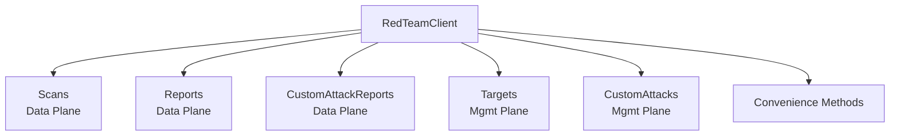

# Red Team API

The Red Team API provides automated attack testing for AI applications. It operates across two planes: data (scans, reports) and management (targets, custom attacks).

## Authentication

Falls back to `PANW_MGMT_*` environment variables if service-specific variables are not set.

```go
client := redteam.NewClient(redteam.Opts{
    ClientID:     "your-client-id",     // or PANW_RED_TEAM_CLIENT_ID
    ClientSecret: "your-client-secret", // or PANW_RED_TEAM_CLIENT_SECRET
    TsgID:        "1234567890",         // or PANW_RED_TEAM_TSG_ID
})
```

## Architecture



## Scans (Data Plane)

```go
// Create a scan job
job, err := client.Scans.Create(ctx, redteam.CreateScanRequest{
    Name:     "security-audit",
    TargetID: "target-uuid",
    // ...
})

// List scans
scans, err := client.Scans.List(ctx, redteam.ScanListOpts{Limit: 10})

// Get scan details
scan, err := client.Scans.Get(ctx, "job-uuid")

// Abort a running scan
resp, err := client.Scans.Abort(ctx, "job-uuid")

// Get attack categories
categories, err := client.Scans.GetCategories(ctx)
for _, cat := range categories {
    fmt.Printf("Category: %s (%d subcategories)\n", cat.Name, len(cat.Subcategories))
}
```

## Reports (Data Plane)

```go
// Get static report (pre-computed)
staticReport, err := client.Reports.GetStatic(ctx, "report-id")

// Get dynamic report (on-demand)
dynamicReport, err := client.Reports.GetDynamic(ctx, "report-id")

// Get combined report
report, err := client.Reports.Get(ctx, "report-id")

// List reports
reports, err := client.Reports.List(ctx, redteam.ReportListOpts{})
```

## Custom Attack Reports (Data Plane)

```go
reports, err := client.CustomAttackReports.List(ctx, redteam.CustomAttackReportListOpts{})
report, err := client.CustomAttackReports.Get(ctx, "report-id")
```

## Targets (Management Plane)

```go
// Create a target
target, err := client.Targets.Create(ctx, redteam.CreateTargetRequest{
    Name: "my-chatbot",
    // ... connection parameters
})

// CRUD operations
targets, err := client.Targets.List(ctx, redteam.TargetListOpts{})
target, err := client.Targets.Get(ctx, "target-uuid")
updated, err := client.Targets.Update(ctx, "target-uuid", redteam.UpdateTargetRequest{...})
resp, err := client.Targets.Delete(ctx, "target-uuid")

// Probe target (validate connection)
probe, err := client.Targets.Probe(ctx, "target-uuid", redteam.ProbeRequest{...})

// Get target profile
profile, err := client.Targets.GetProfile(ctx, "target-uuid")
```

## Custom Attacks (Management Plane)

```go
attack, err := client.CustomAttacks.Create(ctx, redteam.CreateCustomAttackRequest{...})
attacks, err := client.CustomAttacks.List(ctx, redteam.CustomAttackListOpts{})
attack, err := client.CustomAttacks.Get(ctx, "attack-id")
updated, err := client.CustomAttacks.Update(ctx, "attack-id", redteam.UpdateCustomAttackRequest{...})
resp, err := client.CustomAttacks.Delete(ctx, "attack-id")
```

## Convenience Methods

These are available directly on the `RedTeamClient`:

```go
// Scan statistics dashboard
stats, err := client.GetScanStatistics(ctx, redteam.StatsParams{})

// Score trend for a target
trend, err := client.GetScoreTrend(ctx, "target-uuid")

// Quota summary
quota, err := client.GetQuota(ctx)

// Error logs for a job
logs, err := client.GetErrorLogs(ctx, "job-uuid", redteam.ErrorLogOpts{})

// Sentiment
resp, err := client.UpdateSentiment(ctx, redteam.SentimentRequest{...})
sentiment, err := client.GetSentiment(ctx, "job-uuid")

// Management dashboard overview
overview, err := client.GetDashboardOverview(ctx)
```
